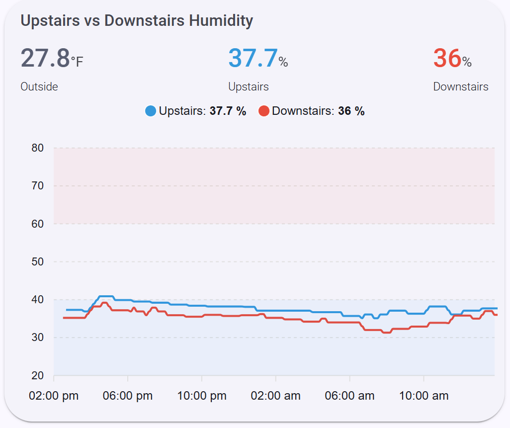

# Automated Whole-House Humidity Control with Home Assistant

A smart home automation project that converts an Aprilaire 400 humidifier to Aprilaire 600 functionality with intelligent, temperature-based humidity control using Home Assistant.

## Table of Contents
- [Overview](#overview)
- [The Problem](#the-problem)
- [The Solution](#the-solution)
- [Hardware Requirements](#hardware-requirements)
- [Installation](#installation)
- [Home Assistant Configuration](#home-assistant-configuration)
- [How It Works](#how-it-works)
- [ApexCharts Humidity Tracking](#apexcharts-humidity-tracking)
- [Results](#results)
- [Lessons Learned](#lessons-learned)

## Overview

This project replaces the mechanical humidistat on an Aprilaire whole-house humidifier with smart automation that dynamically adjusts target humidity levels based on outdoor temperature. The system uses multiple temperature sensors for accuracy and implements automated control with deadband logic to prevent short-cycling.

## The Problem

On the forced hot-air furnace, the Aprilaire 400 humidifier was unable to maintain proper indoor humidity levels during winter months. This was due to two main factors:

1. **Design limitations**: The bypass design of the 400 series has lower capacity compared to the 600 series
2. **Hard water buildup**: Mineral deposits on the water panel reduced effectiveness over time, further limiting performance

## The Solution

The solution involved both a hardware upgrade and complete automation of humidity control:

### Hardware Upgrade
- Convert Aprilaire 400 to 600 functionality using the **AprilAire 4839 Maintenance Kit**
- Install a drain line for continuous water flow (1" OD PVC)
- If draining to condensate pump, you may need to relocate condensate pump lower to achieve proper drainage slope
- Replace mechanical humidistat with smart relay control

### Smart Automation
- Install multiple sensors for accurate humidity and temperature readings
- Calculate optimal indoor humidity based on outdoor temperature
- Automate humidifier operation with intelligent control logic

## Hardware Requirements

### Humidifier Components
- Aprilaire 400 (existing humidifier)
- **AprilAire 4839 Maintenance Kit** (converts 400 to 600 functionality)
- 1" OD PVC pipe for drain line and needed connections (90 and/or 45)
- Condensate pump relocation (if needed for slope and if no nearby floor drain available)
- Saddle valve or T-valve for hot water connection

### Smart Home Components
- **Shelly 1 Gen4** Wi-Fi/Zigbee/Matter Smart Relay Switch with dry contacts
- **12V 2A Power Adapter** (to power the Shelly relay)
- **(2) SONOFF SNZB-02P** Zigbee Temperature/Humidity Sensors
- Home Assistant server with Zigbee coordinator

### Weather Data
- Access to **Ambient Weather Network** or similar local weather station data
- Multiple stations recommended for averaging (this project uses 5 local stations)

## Installation

### Physical Installation

1. **Install AprilAire 4839 Maintenance Kit**
   - Follow AprilAire instructions to convert your 400 to 600 configuration
      - This is straight forward as it is simply replacing the internal frame of the water panel, and installing the drain which is a small insert.
   - This enables continuous water flow operation

2. **Install Drain Line**
   - Run 1" OD PVC from humidifier to drain
   - Ensure proper slope for gravity drainage - 1/4" per foot
   - If nearby floor drain isn't available, you may need to relocate the condensate pump lower

3. **Move Water Feed to Hot Line**
   - Install a new saddle valve (or better a T-valve) on the hot water line for the humidifier feed - More effective evaporation
   - Cap the old cold water saddle valve

4. **Relocate Condensate Pump** (if needed)
   - Lower the condensate pump position to achieve proper drainage slope from humidifier
   - This step may not be necessary if you have a conveniently located floor drain

5. **Remove Mechanical Humidistat**
   - Disconnect the existing Aprilaire humidistat
   - This will be replaced by the Shelly relay

6. **Install Shelly 1 Gen4 Relay**
   - Wire the Shelly relay to control the humidifier water solenoid valve
      - We intercept the furnace 24V hot (R) and route it through the Shelly dry-contact relay to feed the water solenoid, while furnace common (C) connects directly to the water solenoid return.
   - Connect to 12V power supply
   - Configure for dry contact operation
   - Integrate with Home Assistant

7. **Install Humidity Sensors**
   - Mount one SONOFF SNZB-02P sensor centrally on each floor (upstairs and downstairs)
   - Pair sensors with your Zigbee coordinator

### Home Assistant Integration

1. **Add Shelly Relay to Home Assistant**
   - The relay should appear as `switch.furnace_humidity_control` (or customize as needed)

2. **Add SONOFF Sensors to Home Assistant**
   - Sensors should appear with entities like:
     - `sensor.downstairs_temp_humidity_humidity`
     - `sensor.upstairs_temp_humidity_humidity`

3. **Configure Weather Station Integration**
   - Set up Ambient Weather Network integration or similar
   - Ensure you have multiple local temperature sources for averaging

## Home Assistant Configuration

### Template Sensors

Add these template sensors to your `configuration.yaml` or `templates.yaml` Replace entity names and %Home% with your appropriate names:

```yaml
template:
  - sensor:
      # Average indoor humidity from both floors
      - name: "Whole House Humidity"
        unique_id: whole_house_humidity_avg
        unit_of_measurement: "%"
        state: >
          
          
          
            {{ ((h1 + h2) / 2) | round(1) }}
          
            {{ h1 | round(1) }}
          
            {{ h2 | round(1) }}
          
            {{ 'unknown' }}
          

      # Average outdoor temperature from multiple weather stations
      - name: "%Home% Outdoor Temperature"
        unique_id: avg_outdoor_temp
        unit_of_measurement: "°F"
        state: >
          
          
          
            {{ ((valid_temps | sum) / (valid_temps | length)) | round(1) }}
          
            unknown
          

      # Calculate target humidity based on outdoor temperature
      - name: "Target Indoor Humidity"
        unique_id: target_indoor_humidity
        unit_of_measurement: "%"
        state: >
          {% set t = states('sensor.%home%_outdoor_temperature') | float(999) %}
          
            unknown
          
            25
          
            30
          
            35
          
            40
          
            45
          
```

### Automation

Create this automation to maintain humidity levels:

```yaml
alias: Maintain Indoor Humidity Level
description: Humidifier - Maintain Target Indoor Humidity
triggers:
  - trigger: state
    entity_id:
      - sensor.target_indoor_humidity
      - sensor.whole_house_humidity
  - trigger: time_pattern
    minutes: /5
conditions:
  - condition: template
    value_template: "{{ current_rh is not none and target_rh is not none }}"
actions:
  - choose:
      - conditions:
          - condition: template
            value_template: "{{ current_rh <= (target_rh - deadband) }}"
        sequence:
          - action: switch.turn_on
            target:
              entity_id: "{{ humidifier_switch }}"
      - conditions:
          - condition: template
            value_template: "{{ current_rh >= (target_rh + deadband) }}"
        sequence:
          - action: switch.turn_off
            target:
              entity_id: "{{ humidifier_switch }}"
mode: single
variables:
  humidifier_switch: switch.furnace_humidity_control
  current_rh: "{{ states('sensor.whole_house_humidity') | float(none) }}"
  target_rh: "{{ states('sensor.target_indoor_humidity') | float(none) }}"
  deadband: 2
```

## How It Works

### Temperature-Based Humidity Targets

The system automatically adjusts target humidity based on outdoor temperature to prevent condensation on windows while maximizing comfort:

| Outdoor Temperature        | Target Indoor Humidity |
|----------------------------|------------------------|
| <= 0F (-18C)               | 25%                    |
| 1-10F (-17C to -12C)       | 30%                    |
| 11-20F (-12C to -7C)       | 35%                    |
| 21-30F (-6C to -1C)        | 40%                    |
| > 30F (>-1C)               | 45%                    |

### Sensor Averaging

**Indoor Humidity**: Averages readings from sensors on both floors for accurate whole-house measurement. Falls back gracefully if one sensor is unavailable.

**Outdoor Temperature**: Averages readings from five local Ambient Weather Network stations to minimize impact of microclimate variations or sensor errors.

### Control Logic

The automation uses a **2% deadband** to prevent short-cycling:
- **Humidifier turns ON** when: Current humidity ≤ (Target - 2%)
- **Humidifier turns OFF** when: Current humidity ≥ (Target + 2%)

The automation triggers on:
- State changes to target or current humidity
- Every 5 minutes (time pattern)

## ApexCharts Humidity Tracking

For visibility, I use an ApexCharts card in Home Assistant to trend the whole-house humidity against the calculated target. This makes it easy to confirm the automation is holding steady, spot short-cycling, and validate the outdoor-temp-driven target curve over time.

The chart in `Humidity_chart.yaml` is set up to:
- Show outside temperature, plot upstairs and downstairs humidity on the same graph
- Show daily context with clear min/max swings
- Make tuning the deadband and target thresholds obvious from the line separation



## Results

The system has been working very well since installation. Key improvements:

- **Consistent humidity levels**: Maintains target humidity throughout the winter
- **Eliminates manual adjustment**: No need to monitor or adjust humidistat settings
- **Prevents window condensation**: Dynamic targets prevent over-humidification in extreme cold
- **Increased capacity**: The 600 conversion provides significantly better humidification performance
- **Better water panel maintenance**: Continuous water flow helps prevent mineral buildup
- **Water usage**: Using approximately 3.5 gallons (13.25 L) per furnace cycle, though this varies depending on furnace efficiency and cycle duration

## Future upgrades

Potential next steps include:
- Automation to alert if humidity gets out of whack
- Automation to monitor for excessive water usage (currently using Droplet)
- Implement PWM (Pulse Width Modulation) for the solenoid. Instead of leaving the water on 100% of the time the fan is running, cycle it (e.g., 2 minutes on, 2 minutes off). This keeps the panel wet enough for evaporation but reduces water waste.

## Lessons Learned

### Hard Water Considerations
Hard water was a contributing factor to the original Aprilaire 400's poor performance. Even with the upgrade to 600 functionality, monitor the water panel for mineral deposits and replace as needed per manufacturer recommendations.

### Drainage Is Critical
When installing the drain line, proper slope is essential. If you don't have a nearby floor drain:
- Budget time for relocating the condensate pump lower
- Ensure you have adequate vertical space to achieve proper drainage slope
- Consider this during initial planning to avoid rework

### Sensor Placement
Central locations on each floor provide the most representative humidity readings. Avoid placing sensors:
- Near exterior walls or windows
- In bathrooms or kitchens
- Near heating vents
- In direct sunlight

### Weather Station Averaging
Using multiple weather stations significantly improves accuracy:
- Reduces impact of individual station failures
- Minimizes microclimate effects
- Provides more stable temperature readings for target calculations

## Contributing

Feel free to open issues or submit pull requests if you have suggestions for improvements or find any bugs in the configuration.

## License

This project is provided as-is for educational and personal use.

---

**Questions?** Open an issue and I'll be happy to help!
